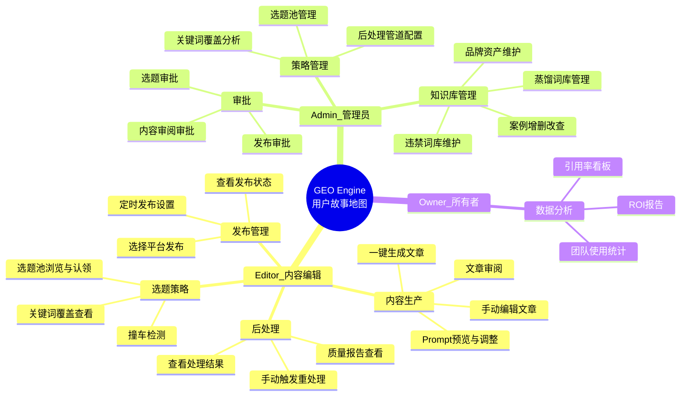

# 02 · 用户故事地图

> 按用户角色和模块组织的用户故事及验收标准。每个故事可直接转化为开发任务。

---

## 一、用户故事地图

---

## 二、Editor 故事（8 个）

### US-01 撞车检测

> 作为 Editor，输入选题关键词后系统自动检测是否与已有文章撞车，帮我避免重复生产。

**验收标准**：
- [ ] 输入关键词后系统检索已有文章库，返回撞车级别（🔴撞车/🟡角度重合/🟢安全/🆕新选题）
- [ ] 撞车报告包含：撞车级别、相关文章列表（编号+标题+关键词）、调整建议
- [ ] 🟢/🆕 结果可直接进入下一步 Prompt 组装
- [ ] 检测响应时间 < 2 秒

### US-02 选题池浏览与认领

> 作为 Editor，可以浏览选题池中按优先级排列的选题，认领感兴趣的选题进行生产。

**验收标准**：
- [ ] 选题列表按 P0→P1→P2→P3 优先级排序
- [ ] 每个选题卡片展示：关键词、推荐格式、推荐案例、预估字数
- [ ] 点击"认领"后选题状态变为 claimed，进入我的生产队列
- [ ] P0 选题展示"7 天内认领"倒计时

### US-03 一键生成文章

> 作为 Editor，确认选题后系统自动完成 Prompt 组装和 AI 生成，我只需要等待结果。

**验收标准**：
- [ ] 确认选题后系统自动组装 Prompt（含品牌知识 + 蒸馏变量 + 规则注入）
- [ ] 生成前展示 Prompt 预览，允许手动调整后确认
- [ ] 调用 AI 引擎生成文章，展示生成进度
- [ ] 引擎故障时自动切换 fallback 引擎，对用户透明
- [ ] 生成失败展示：错误原因 + 建议操作（重试/换引擎/调整参数）

### US-04 文章审阅

> 作为 Editor，生成完成后可以预览文章并做出通过/修改/放弃的决策。

**验收标准**：
- [ ] 生成完成后展示：文章预览（标题+正文摘要+字数+引擎信息）、质量预检结果
- [ ] 三个操作选项：✅通过（进入后处理）、✏️修改意见（退回手动编辑）、🔄重新生成、❌放弃
- [ ] 24 小时未操作，自动取消并放回选题池

### US-05 查看后处理结果

> 作为 Editor，系统自动执行后处理管道后，可以查看每一步的处理结果和最终文章。

**验收标准**：
- [ ] 展示 7 步管道每步的执行状态（✅完成/⏭跳过/❌失败）
- [ ] 可选择任一步骤查看处理前后的对比
- [ ] 最终文章 + 质量报告（评分+各维度详情）一起展示
- [ ] 质量不达标项高亮标注，附带修改建议

### US-06 手动编辑文章

> 作为 Editor，可以在系统生成的基础上手动编辑文章内容。

**验收标准**：
- [ ] 支持 Markdown 编辑和预览
- [ ] 编辑后可重新触发后处理管道（或仅重跑受影响步骤）
- [ ] 编辑历史可查看和回退
- [ ] 保存后自动更新索引

### US-07 选择平台发布

> 作为 Editor，文章就绪后可以选择目标平台并执行发布。

**验收标准**：
- [ ] 展示各平台的适配预览（知乎版/公众号版/小红书版...）
- [ ] 选择平台后可设置立即发布或定时发布
- [ ] 微信平台自动调用草稿箱 API
- [ ] 手动平台（知乎/百家号等）生成适配文本，提醒粘贴后回填 URL
- [ ] 发布状态实时更新

### US-08 查看发布状态

> 作为 Editor，可以查看每篇文章在各个平台的发布状态。

**验收标准**：
- [ ] 发布任务列表：平台/状态（待发/已排期/已发布/失败）/时间/公开URL
- [ ] 失败任务展示错误原因和重试入口
- [ ] 支持按平台和状态筛选

---

## 三、Admin 故事（7 个）

### US-09 案例管理

> 作为 Admin，可以管理品牌案例库，添加、编辑、删除案例数据。

**验收标准**：
- [ ] 案例列表：简称/行业/规模/引用次数/脱敏状态
- [ ] 添加案例：企业全称、简称、行业、规模、核心数据（结构化JSON）、适配场景
- [ ] 编辑案例后展示"此案例已被 N 篇文章引用，变更不回溯历史文章"
- [ ] 有文章引用的案例不可删除（先解除关联）

### US-10 蒸馏词库管理

> 作为 Admin，可以管理三层蒸馏词库（品牌词/关键词/区域词），控制蒸馏行为。

**验收标准**：
- [ ] 品牌词变体：品牌名→全称/简称/俗称/方法论名/英文名（可增删）
- [ ] 关键词变体：核心关键词→长尾词/问题形式/近义词/口语表达（可增删）
- [ ] 区域词库：省→市→区层级数据（系统内置+可自定义）
- [ ] 修改后影响预览：展示"使用新变体的 Prompt 示例"

### US-11 违禁词库维护

> 作为 Admin，可以维护品牌的违禁词库，确保文章发布前零违禁词。

**验收标准**：
- [ ] 违禁词列表：词/类别/替换建议/启停状态
- [ ] 支持批量导入（CSV）
- [ ] 修改后提示"将影响所有后续生成文章的扫描结果"

### US-12 选题池管理

> 作为 Admin，可以管理选题池，规划内容方向和优先级。

**验收标准**：
- [ ] 创建选题：关键词/推荐格式/平台/品牌级/P0-P3优先级/推荐案例
- [ ] 选题列表可按优先级、状态、创建时间排序
- [ ] P0 选题超 7 天未认领自动降 P2（系统规则，可配置）
- [ ] 放弃的选题保留记录不删除（防止重复选题）

### US-13 关键词覆盖分析

> 作为 Admin，可以查看关键词覆盖矩阵，发现内容策略缺口。

**验收标准**：
- [ ] 覆盖矩阵：关键词/已发文章数/覆盖状态（多角度/已覆盖/待覆盖）
- [ ] 点击关键词展开已发文章列表
- [ ] 支持导出 CSV

### US-14 后处理管道配置

> 作为 Admin，可以配置后处理管道的步骤和参数。

**验收标准**：
- [ ] 启用/禁用某一步骤
- [ ] 调整步骤参数（如 EEAT 增强强度、质量评分阈值）
- [ ] 配置变更后"预览效果对比"功能

### US-15 审批操作

> 作为 Admin，可以收到审批通知并进行审批决策。

**验收标准**：
- [ ] 审批通知：展示待审批项（选题/内容/发布）的关键信息
- [ ] 操作选项：✅通过 / ✏️修改意见（附文本）/ ❌拒绝
- [ ] 审批历史和轨迹可追溯
- [ ] 审批超时（24h）自动处理规则

---

## 四、Owner 故事（2 个）

### US-16 引用率看板

> 作为 Owner，可以查看文章在 AI 引擎中的引用效果趋势。

**验收标准**：
- [ ] 展示各引擎引用评分趋势图（按周/月）
- [ ] 展示引用率最高/最低的文章 TOP 10
- [ ] 按关键词、时间段、引擎筛选

### US-17 ROI 报告

> 作为 Owner，可以查看文章生产的投入产出数据。

**验收标准**：
- [ ] 投入数据：Token 消耗量+费用、文章生成数
- [ ] 产出数据：引用率变化、各引擎引用排名
- [ ] 按月/季度/年度汇总

---

## 五、故事-模块映射

| 模块 | 关联故事 |
|------|---------|
| 选题策略 | US-01, US-02, US-12, US-13 |
| 内容编排 | US-03, US-10 |
| AI生成 | US-03 |
| 后处理管道 | US-05, US-06, US-14 |
| 内容仓库 | US-04（文章预览） |
| 知识库 | US-09, US-10, US-11 |
| 发布管理 | US-07, US-08 |
| 效果追踪 | US-16, US-17 |
| 审批 | US-04, US-15 |

---

## 六、优先级

| 优先级 | 故事 | MVP 必须 |
|:---:|------|:---:|
| P0 | US-01, US-02, US-03, US-04, US-05, US-07, US-08, US-09, US-11, US-15 | ✅ |
| P1 | US-06, US-12, US-13, US-14 | |
| P2 | US-10, US-16 | |
| P3 | US-17 | |

**MVP = 10 个 P0 故事 + 4 个 P1 故事 = 系统可完整运行的生产闭环。**
