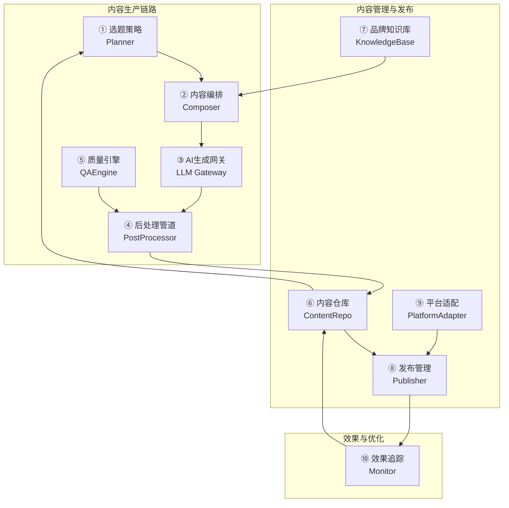
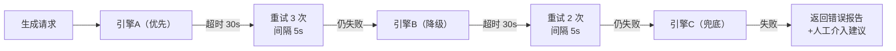
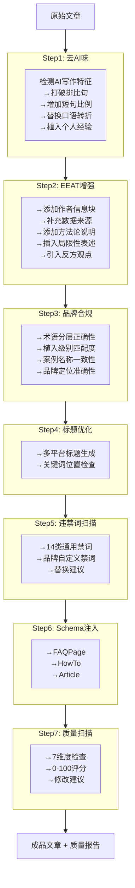
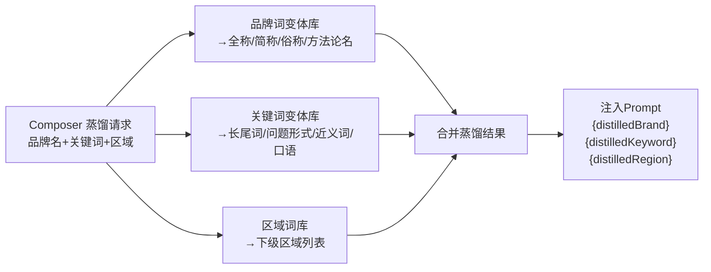

# 03 · 模块功能规格

> 每个模块的职责边界、功能清单、输入输出和校验规则。可直接指导开发。

---

## 一、模块总览



---

## 二、选题策略（Planner）

### 2.1 职责

管理选题全生命周期：关键词覆盖、撞车检测、选题池、场景因子。为内容生产提供"写什么"的决策依据。

### 2.2 功能清单

| 功能 | 输入 | 输出 | 校验规则 |
|------|------|------|---------|
| 撞车检测 | 关键词 + 格式 + 平台 | 撞车报告（级别/相关文章/建议） | 关键词不能为空 |
| 选题池列表 | 筛选条件（优先级/状态/关键词） | 选题卡片列表（按优先级排序） | — |
| 创建选题 | 关键词/格式/平台/品牌级/优先级/案例 | 选题卡片 | 关键词必填，优先级默认 P2 |
| 认领选题 | 选题 ID | 选题状态→claimed，进入生产队列 | 选题必须为 pending 状态 |
| 关键词覆盖矩阵 | 品牌 ID | 关键词×覆盖状态矩阵 | — |
| 缺口分析 | 品牌 ID | 覆盖为"待覆盖"的关键词列表 | — |
| 场景因子配置 | 品牌 ID + 7 因子值 | 因子配置生效 | 因子值在预定义范围内 |

### 2.3 选题优先级规则

| 规则 | 说明 |
|------|------|
| 优先级排序 | P0 > P1 > P2 > P3。同级按创建时间倒序 |
| P0 自动降级 | 创建后 7 天未认领 → 自动降为 P2。降级前 1 天发通知 |
| 放弃保留 | abandoned 状态选题保留 90 天，防止重复创建 |
| 热点标记 | 热点选题创建时优先级自动+1（P2→P1），24h 后恢复 |

---

## 三、内容编排（Composer）

### 3.1 职责

将选题卡片 + 品牌知识库 + 蒸馏引擎输出 → 拼装为完整 Prompt，交由 LLM Gateway 生成文章。

### 3.2 功能清单

| 功能 | 输入 | 输出 | 校验规则 |
|------|------|------|---------|
| Prompt 组装 | 选题卡片（关键词/格式/平台/品牌级） | 完整 Prompt（System+Context+Task+Rules） | 关键词必填，格式/平台必选 |
| 变量注入 | Prompt 模板 + 品牌 ID | 变量替换后的 Prompt | 缺失变量标红提示 |
| 品牌词蒸馏 | 品牌名 | 品牌词变体列表（全称/简称/俗称/方法论名/英文） | 品牌词库必须有该品牌 |
| 关键词蒸馏 | 核心关键词 | 长尾词/问题形式/近义词/口语表达 | 关键词变体库有数据则用，无可跳过 |
| 区域词蒸馏 | 目标区域名 | 下级区域列表 | 区域词库有数据则用，无可跳过 |
| Prompt 模板管理 | 模板名+内容+变量定义 | 模板注册生效 | 变量占位符格式校验 |
| Prompt 预览 | 组装完成的 Prompt | 可预览和手动编辑的 Prompt 文本 | — |

### 3.3 变量注入优先级

```
{keyword}          必填 — Prompt 核心，不可为空
{brandTerms}       必填 — 品牌术语分层注入
{distilledBrand}   必填 — 品牌词蒸馏结果
{distilledKeyword} 选填 — 关键词蒸馏结果（有变体库数据时）
{distilledRegion}  选填 — 区域蒸馏结果（客户配置了目标区域时）
{cases}            必填 — 场景匹配 Top 3 案例
{sceneFactors}     必填 — 7 因子按选题自动匹配
{competitorIntel}  选填 — 有匹配竞品数据时
{theoryCards}      选填 — 有匹配理论卡片时
{dataStats}        选填 — 有匹配数据引用时
{objectionResponse} 选填 — 有匹配异议处理时
```

---

## 四、AI 生成网关（LLM Gateway）

### 4.1 职责

封装多 AI 引擎调用，提供统一的生成接口、fallback 和成本追踪。

### 4.2 功能清单

| 功能 | 输入 | 输出 | 异常处理 |
|------|------|------|---------|
| 生成文章 | Prompt + 引擎优先级 + 参数（maxTokens/temperature） | 文章正文 + 元数据（引擎/耗时/Token用量） | 见 fallback 策略 |
| 引擎列表 | — | 可用引擎列表（含健康状态） | — |
| Token 消耗查询 | 时间段/引擎 | Token 数+费用 | — |
| 流式生成 | Prompt + 引擎 | SSE 流式返回文章 | 断连重试 1 次 |

### 4.3 Fallback 策略



---

## 五、后处理管道（PostProcessor）

### 5.1 职责

对 AI 生成的原始文章执行 7 步管道优化，每步可配置启用/禁用和参数。

### 5.2 管道定义



### 5.3 管道配置项

| 配置项 | 默认值 | 可配置范围 |
|--------|:---:|------|
| 去AI味强度 | 标准 | 轻度/标准/深度 |
| EEAT 增强级别 | 标准 | 轻度（仅作者块+数据来源）/标准（全5项）/深度（增强+额外引用） |
| 标题生成数量 | 3 | 1-10 |
| 质量评分阈值 | 70 | 0-100 |
| 违禁词策略 | 拦截+建议 | 仅告警/拦截+建议 |
| Schema 类型 | 自动判断 | 自动/指定（FAQPage/HowTo/Article）/关闭 |

---

## 六、质量引擎（QAEngine）

### 6.1 职责

对文章执行 7 维度质量检查，输出评分和修改建议。可被 PostProcessor 调用（管道内嵌）或 CLI 独立调用。

### 6.2 检查维度

| 维度 | 检查内容 | 阈值/标准 | 权重 |
|------|---------|---------|:---:|
| 违禁词 | 品牌禁词库全文扫描 | 0 出现 | 致命（出现即 0 分） |
| 关键词密度 | 核心关键词出现频率 | 2%-3% | 15% |
| 句长分布 | 短句(≤15字)/长句(>35字)占比 | 短句≥30%，长句≤15% | 15% |
| EEAT 信号 | 5 项信号检查 | 5/5 通过 | 20% |
| 结构完整性 | H2/H3/表格/FAQ | 至少含 H2×2 + 表格或FAQ | 15% |
| 品牌一致性 | 术语/案例/植入级别 | 全部一致 | 20% |
| 区域词分布 | 蒸馏区域词的覆盖度 | 各蒸馏区域词≥1次 | 15% |

### 6.3 评分公式

```
总分 = Σ(各维度得分 × 权重)
违禁词维度为致命项：出现违禁词 → 总分 = 0

通过标准：总分 ≥ 阈值（默认 70）
不通过 → 展示所有不达标项 + 修改建议 → 人工处理后重扫描
```

---

## 七、内容仓库（ContentRepo）

### 7.1 职责

管理文章的全生命周期数据：创建、存储、索引维护、状态流转。

### 7.2 功能清单

| 功能 | 输入 | 输出 |
|------|------|------|
| 创建文章 | 标题/正文/格式/平台/品牌级/关键词/案例 | 文章记录 + 目录结构 |
| 更新文章 | 文章ID + 变更字段 | 更新后的文章 |
| 文章列表 | 筛选条件（状态/格式/平台/关键词） | 分页列表 |
| 索引维护 | 文章变更事件 | 自动更新关键词矩阵/案例频次/格式分布 |
| 索引导出 | 格式（MD/JSON/CSV） | 文件下载 |
| 目录创建 | 文章编号+slug | {编号}-{slug}/ 目录 + 子文件 |

### 7.3 文章目录规范

```
articles/{NN}-{slug}/
  ├── article.md          文章正文
  ├── cover-prompt.md     封面 Prompt（可选）
  └── image-registry.json 引用图片清单（可选）
```

---

## 八、品牌知识库（KnowledgeBase）

### 8.1 职责

统一管理和查询品牌知识资产，为 Composer 和 PostProcessor 提供数据。

### 8.2 资产类型

| 类型 | 说明 | 查询方式 |
|------|------|---------|
| 案例（case） | 企业案例的结构化数据 | 按关键词/行业/场景匹配 |
| 理论卡片（theory） | 方法论/框架 | 按主题匹配 |
| 品牌资产（brand_info） | 品牌名称/理念/差异化 | 直接查询 |
| 竞品情报（competitor） | 竞品对比数据 | 按关键词/维度匹配 |
| 数据引用（data_stat） | 统一口径的数据点 | 按 key 查询 |
| 异议处理（objection） | 标准回应模板 | 按话题匹配 |
| 品牌词变体（brand_variant） | 品牌名→变体列表 | Composer 蒸馏时查询 |
| 关键词变体（keyword_variant） | 关键词→变体列表 | Composer 蒸馏时查询 |
| 区域词库（region_dict） | 省→市→区→商圈 | Composer 蒸馏时查询 |
| 违禁词（banned_word） | 禁词+替换建议 | QAEngine 扫描时查询 |

### 8.3 蒸馏引擎数据流



---

## 九、平台适配（PlatformAdapter）

### 9.1 职责

将文章转换为各发布平台要求的格式。

### 9.2 平台适配规格

| 平台 | 格式 | 字数 | 语气 | Schema |
|------|:---:|------|------|:---:|
| 知乎 | Markdown | 1500-2500 | 第一人称专家 | 保留 |
| 公众号 | 富文本 | 1800-2500 | 第三人称分析 | 移除 |
| 百家号 | 富文本 | 1500-2200 | 客观专业 | 移除 |
| 小红书 | 短图文 | 800-1200 | 口语化清单 | 移除 |
| 微博 | 短图文 | 500-800 | 话题驱动 | 移除 |

### 9.3 功能清单

| 功能 | 输入 | 输出 |
|------|------|------|
| 格式转换 | 文章 Markdown + 目标平台 | 平台适配文本 |
| Schema 处理 | 文章 + 平台 Schema 策略 | 保留/移除 Schema 后的内容 |
| 预览 | 文章 + 所有已适配平台 | 多平台并排预览 |

---

## 十、发布管理（Publisher）

### 10.1 职责

管理文章的发布调度、执行和状态追踪。

### 10.2 功能清单

| 功能 | 说明 |
|------|------|
| 创建发布任务 | 文章+平台+时间（立即/定时） |
| 微信草稿箱 | 调用 API 创建草稿 |
| 手动发布追踪 | 生成适配文本 → 提醒粘贴 → 回填 URL → 更新状态 |
| 定时调度 | 按指定时间自动执行发布 |
| 发布状态查询 | 按文章/平台/状态筛选 |
| 重试失败任务 | 失败任务重新触发 |

### 10.3 发布优先级

微信（有API可自动）→ 知乎 → 百家号 → 小红书 → 微博。微信与其他平台间隔 ≥ 2 小时。

---

## 十一、效果追踪（Monitor）

### 11.1 职责

定时扫描文章在 AI 引擎中的引用情况，回写数据，触发异常告警。

### 11.2 追踪计划

| 里程碑 | 时机 | 目的 |
|--------|------|------|
| Week 1 | 发布后第 7 天 | 初期引用收录检查 |
| Month 1 | 发布后第 30 天 | 稳定引用评估 |
| Month 3 | 发布后第 90 天 | 长期效果评估 |

### 11.3 引用评分（1-5）

| 5 | 多引擎(≥3)引用，排名靠前 | 3 | 偶尔被引用 | 1 | 无引用 |
| 4 | 部分引擎(1-2)引用 | 2 | 很少被引用 | | |

### 11.4 异常告警

| 触发条件 | 告警动作 |
|---------|---------|
| 评分 4+ → 2- 骤降 | 通知 Admin + 标记文章"需关注" |
| 连续两次检查评分下降 | 同上 |
| 主要引擎中搜索消失 | 同上 |
| 竞品新文章排名反超 | 通知 Admin（v2+） |
