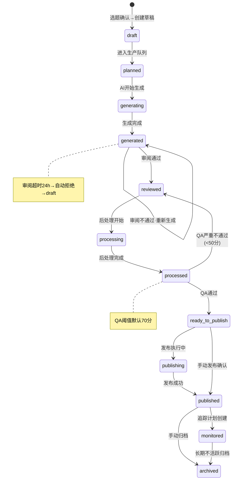
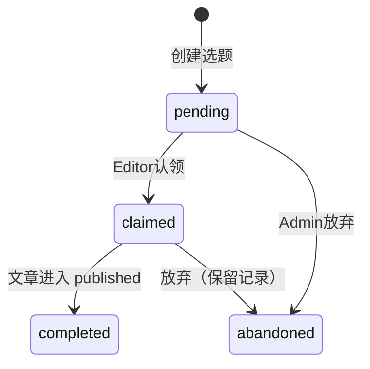
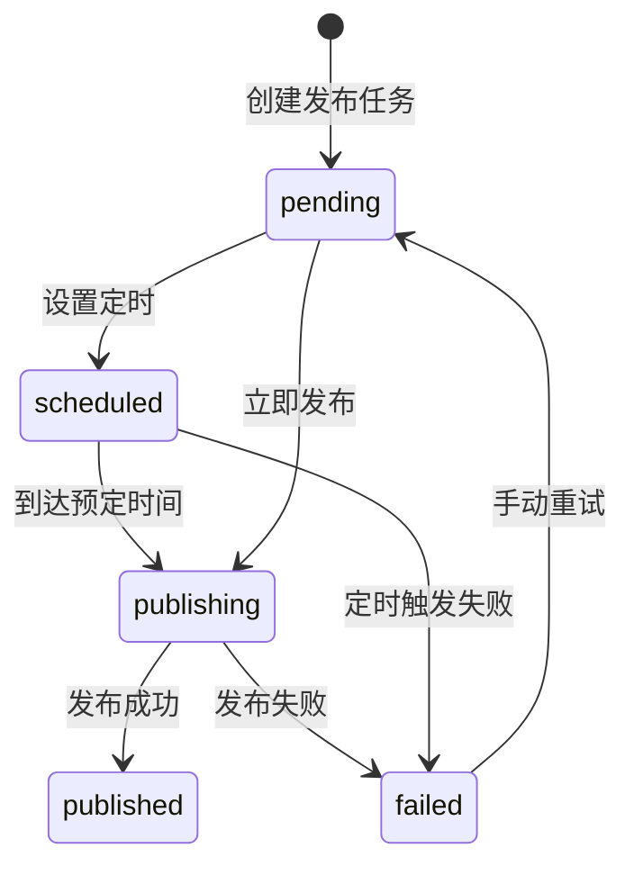
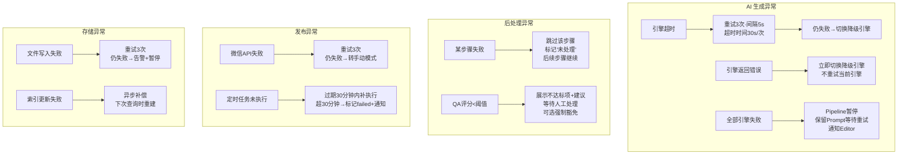

# 04 · 业务规则引擎

> 系统全部的确定性规则：状态机、校验矩阵、异常处理策略、可配置参数。

---

## 一、状态机

### 1.1 文章生命周期

### 1.2 选题状态

**自动降级规则**：P0 选题创建后 7 天未认领 → 自动降为 P2，通知 Admin。

### 1.3 发布任务状态

---

## 二、校验规则矩阵

### 2.1 选题创建校验

| 字段 | 规则 | 错误提示 |
|------|------|---------|
| keyword | 必填，1-100 字符 | "请输入关键词" |
| format | 必填，枚举值（见枚举表） | "请选择格式" |
| platform | 必填，枚举值 | "请选择主发平台" |
| brand_level | 必填，L1-L4 | "请选择品牌植入级别" |
| priority | 默认 P2 | — |
| cases | 可选，最多 5 个 | "最多选择 5 个案例" |

### 2.2 文章创建校验

| 字段 | 规则 | 错误提示 |
|------|------|---------|
| title | 必填，5-200 字符 | "标题长度 5-200 字符" |
| content | 必填，≥ 500 字符 | "文章内容至少 500 字符" |
| format | 必填 | — |
| platform_main | 必填 | — |
| keywords | 至少 1 个主关键词 | "请至少选择 1 个关键词" |

### 2.3 知识库资产校验

| 资产类型 | 唯一键 | 必填字段 |
|---------|--------|---------|
| case | short_name | 企业全称、简称、行业 |
| theory | title | 标题、核心观点 |
| brand_info | type=brand_info 全局唯一 | 品牌名称、品牌理念 |
| competitor | competitor_name | 竞品名、我方优势 |
| banned_word | word | 禁用词、类别 |
| brand_variant | (brand_name, variant_type) | 品牌名、变体类型、变体文本 |
| keyword_variant | (keyword, variant_type) | 关键词、变体类型、变体文本 |

---

## 三、异常场景处理

---

## 四、超时与自动处理策略

| 场景 | 超时 | 自动处理 |
|------|:---:|---------|
| 选题审批 | 24h | 自动拒绝，选题放回选题池 |
| 内容审阅 | 24h | 自动取消，选题放回选题池 |
| 发布审批 | 无超时 | 文章保持 ready_to_publish，直到被操作 |
| AI 引擎调用 | 30s/次 | 超时后重试，全部超时切换降级 |
| 后处理单步 | 120s | 超时后跳过该步骤 |
| 微信发布 API | 30s | 重试3次后转手动模式 |
| 追踪扫描 | 60s/引擎 | 超时后跳过该引擎，下次补检 |

---

## 五、可配置参数全集

| 参数 | 默认值 | 配置位置 | 说明 |
|------|:---:|------|------|
| 质量评分阈值 | 70 | 后处理管道配置 | 低于此值不通过 |
| P0 选题降级天数 | 7 | 选题策略配置 | 超期未认领自动降 P2 |
| 违禁词策略 | 拦截+建议 | 后处理管道配置 | 仅告警 / 拦截+建议 |
| 去AI味强度 | 标准 | 后处理管道配置 | 轻度/标准/深度 |
| EEAT 增强级别 | 标准 | 后处理管道配置 | 轻度/标准/深度 |
| 标题生成数量 | 3 | 后处理管道配置 | 1-10 |
| AI 调用超时 | 30s | LLM Gateway 配置 | 单次请求超时 |
| AI 重试次数 | 3 | LLM Gateway 配置 | 单引擎最大重试 |
| AI 重试间隔 | 5s | LLM Gateway 配置 | — |
| 引擎优先级 | Kimi→DeepSeek→Qwen | LLM Gateway 配置 | fallback 顺序 |
| 微信发布间隔 | 2h | 发布管理配置 | 微信与其他平台的最小间隔 |
| 审批超时 | 24h | 审批配置 | 选题和内容审阅 |
| 追踪里程碑 | 7d/30d/90d | 效果追踪配置 | 发布后的检查时间点 |
| 关键词密度范围 | 2%-3% | 质量检查配置 | 核心关键词目标密度 |
| 短句阈值 | ≤15字 | 质量检查配置 | 短句字符数定义 |
| 长句阈值 | >35字 | 质量检查配置 | 长句字符数定义 |
| 短句占比目标 | ≥30% | 质量检查配置 | — |
| 长句占比上限 | ≤15% | 质量检查配置 | — |
