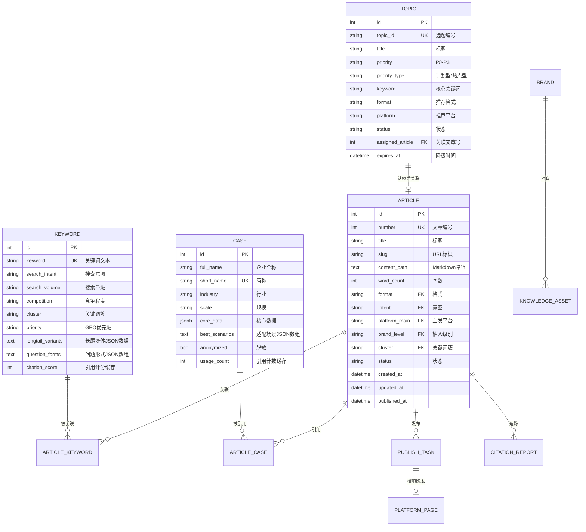

# 05 · 数据规格定义

> 核心实体的字段定义、类型、约束、枚举值全集。开发时直接使用。

---

## 一、实体 ER 图



---

## 二、Article（文章）

| 字段 | 类型 | 必填 | 约束 | 说明 |
|------|------|:--:|------|------|
| id | integer | ✅ | PK, 自增 | — |
| number | integer | ✅ | UK, 不可变 | 文章编号，如 142 |
| title | varchar(300) | ✅ | 5-300 字符 | — |
| slug | varchar(100) | ✅ | UK, 字母数字横线 | 如 "behavior-quantification" |
| content_path | varchar(500) | 创建时 | 不可为空 | articles/{number}-{slug}/article.md |
| word_count | integer | | ≥ 500 | — |
| format | varchar(30) | ✅ | 枚举 | 见 §七 |
| intent | varchar(20) | ✅ | 枚举 | 见 §七 |
| platform_main | varchar(10) | ✅ | 枚举 | 见 §七 |
| brand_level | varchar(5) | ✅ | 枚举 | L1/L2/L3/L4 |
| cluster | varchar(5) | | 枚举 | C1-C5 |
| status | varchar(20) | ✅ | 枚举 | 见 04 §1.1 状态机 |
| created_at | datetime | ✅ | auto | — |
| updated_at | datetime | ✅ | auto | 每次更新自动刷新 |
| published_at | datetime | | | 状态变为 published 时写入 |

---

## 三、Keyword（关键词）

| 字段 | 类型 | 必填 | 约束 | 说明 |
|------|------|:--:|------|------|
| id | integer | ✅ | PK | — |
| keyword | varchar(100) | ✅ | UK | 核心关键词 |
| search_intent | varchar(20) | | 枚举 | 信息型/商业型/交易型 |
| search_volume | varchar(10) | | 枚举 | 高/中/低 |
| competition | varchar(10) | | 枚举 | 高/中/低 |
| cluster | varchar(5) | | 枚举 | C1-C5 |
| priority | varchar(5) | | 枚举 | ⭐-⭐⭐⭐⭐⭐ |
| longtail_variants | text | | JSON 数组 | ["变体1","变体2"] |
| question_forms | text | | JSON 数组 | ["什么是...","如何..."] |
| citation_score | integer | | 1-5 | Monitor 回写的缓存值 |

---

## 四、Case（案例）

| 字段 | 类型 | 必填 | 约束 | 说明 |
|------|------|:--:|------|------|
| id | integer | ✅ | PK | — |
| full_name | varchar(100) | ✅ | | 企业全称 |
| short_name | varchar(50) | ✅ | UK | 简称 |
| industry | varchar(50) | ✅ | | 行业 |
| scale | varchar(30) | ✅ | | 规模描述 |
| core_data | jsonb | | | {"员工数":3000,"营收":"50亿","提效":"30%"} |
| best_scenarios | text | | JSON 数组 | ["5方案对比","案例研究"] |
| anonymized | boolean | | 默认 false | 是否脱敏 |
| usage_count | integer | | 默认 0 | 引用计数缓存 |

---

## 五、Topic（选题）

| 字段 | 类型 | 必填 | 约束 | 说明 |
|------|------|:--:|------|------|
| id | integer | ✅ | PK | — |
| topic_id | varchar(20) | ✅ | UK | TOP-01 / TOP-H01 |
| title | varchar(300) | ✅ | | 选题标题 |
| priority | varchar(5) | ✅ | 枚举 | P0/P1/P2/P3 |
| priority_type | varchar(10) | | 枚举 | planned/hot |
| keyword | varchar(100) | ✅ | | 核心关键词 |
| format | varchar(30) | | 枚举 | 推荐格式 |
| platform | varchar(10) | | 枚举 | 推荐平台 |
| status | varchar(20) | ✅ | 枚举 | 见 04 §1.2 |
| assigned_article | integer | | FK→articles.number | 认领后填入 |
| expires_at | datetime | | | P0 降级时间 = created_at + 7d |

---

## 六、KnowledgeAsset（知识资产）

| 字段 | 类型 | 必填 | 约束 | 说明 |
|------|------|:--:|------|------|
| id | integer | ✅ | PK | — |
| type | varchar(30) | ✅ | | 见枚举表 |
| key | varchar(100) | ✅ | (type, key) UK | 资产唯一键 |
| title | varchar(200) | | | 资产标题 |
| content | jsonb | ✅ | | 结构化内容 |
| tags | text[] | | | 标签数组 |

### 各 type 的 content JSON 结构

**case**：
```json
{"full_name":"","short_name":"","industry":"","scale":"","core_data":{},"scenarios":[]}
```

**theory**：
```json
{"title":"","core_viewpoint":"","applicable_scenarios":[],"brand_connection":""}
```

**brand_info**（全局唯一）：
```json
{"brand_name":"","brand_philosophy":"","differentiation":"","founding_story":""}
```

**competitor**：
```json
{"competitor_name":"","comparison_dimensions":[],"our_advantage":"","their_weakness":""}
```

**brand_variant**：
```json
{"brand_name":"","variant_type":"full_name|short_name|nickname|method_name|english","variant_text":""}
```

**keyword_variant**：
```json
{"keyword":"","variant_type":"long_tail|question_form|synonym|colloquial","variant_text":""}
```

**region_dict**：
```json
{"region_code":"110108","region_name":"海淀区","parent_code":"110000","level":"district"}
```

**banned_word**：
```json
{"word":"","category":"","replacement":"","source":"platform|custom","enabled":true}
```

---

## 七、枚举值全集

### 文章格式（format）

| 值 | 说明 |
|----|------|
| 5方案对比 | 多方案横向对比分析 |
| 案例研究 | 单一案例深度剖析 |
| 避坑指南 | 常见误区与正确做法 |
| 思想领导力 | 行业趋势与前瞻观点 |
| How-To指南 | 操作步骤与落地指南 |
| FAQ | 常见问题解答 |
| 数据报告 | 数据驱动的行业分析 |

### 意图（intent）

| 值 | 说明 |
|----|------|
| 信息型 | 用户搜索信息、了解概念 |
| 商业型 | 用户对比方案、评估供应商 |
| 交易型 | 用户准备购买、寻找服务商 |

### 平台（platform_main）

| 值 | 平台 |
|----|------|
| zh | 知乎 |
| wx | 微信公众号 |
| bjh | 百家号 |
| xhs | 小红书 |
| wb | 微博 |

### 品牌植入级别（brand_level）

| 值 | 植入深度 | 触发场景 |
|----|---------|---------|
| L1 | 轻植入（仅记忆层品牌词） | 信息型/非获客内容 |
| L2 | 标准（表达层+记忆层） | 信息型+商业型 |
| L3 | 深度（四层全部） | 商业型/交易型 |
| L4 | 转化（全层+CTA） | 交易型 |

### 关键词簇（cluster）

| 值 | 说明 |
|----|------|
| C1 | 工具选型 |
| C2 | 管理困境 |
| C3 | 代际冲突 |
| C4 | 案例实证 |
| C5 | 趋势展望 |

### 知识资产类型（knowledge_asset.type）

| 值 | 说明 |
|----|------|
| case | 案例 |
| theory | 理论卡片 |
| brand_info | 品牌资产 |
| competitor | 竞品情报 |
| data_stat | 数据引用 |
| objection | 异议处理 |
| brand_variant | 品牌词变体 |
| keyword_variant | 关键词变体 |
| region_dict | 区域词库 |
| banned_word | 违禁词 |

### 发布任务状态（publish_task.status）

| 值 | 说明 |
|----|------|
| pending | 待发布 |
| scheduled | 已排期 |
| publishing | 发布中 |
| published | 已发布 |
| failed | 发布失败 |

### 用户角色（tenant_role）

| 值 | 可操作范围 |
|----|----------|
| owner | 全部（含套餐/成员管理） |
| admin | 知识库+策略+审批+内容+查看 |
| editor | 选题→生成→后处理→发布 |
| viewer | 只读（内容+数据） |
