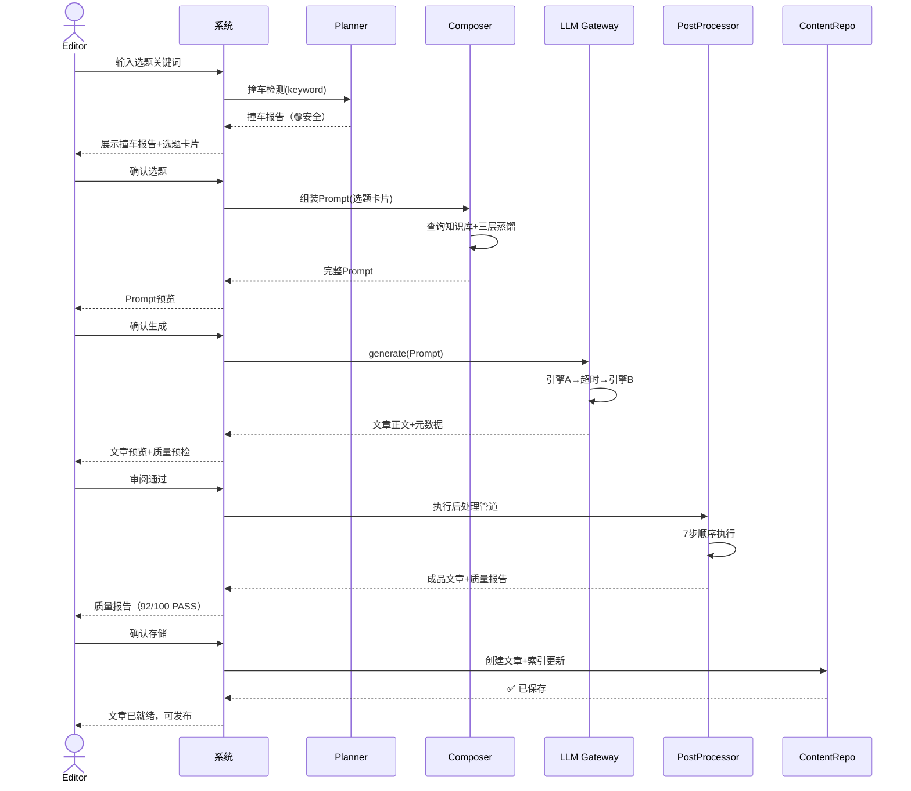
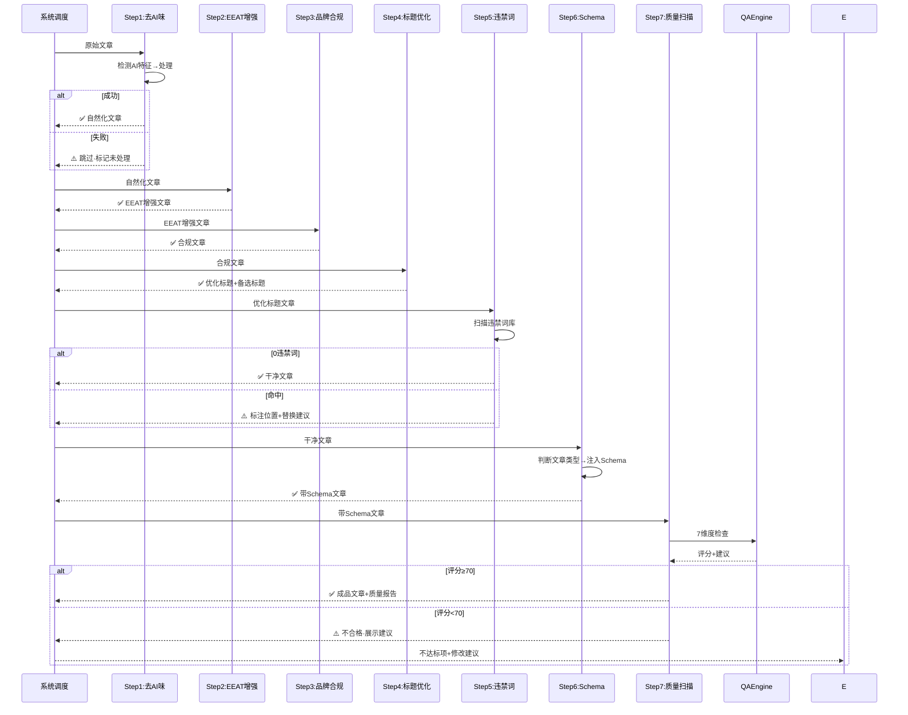
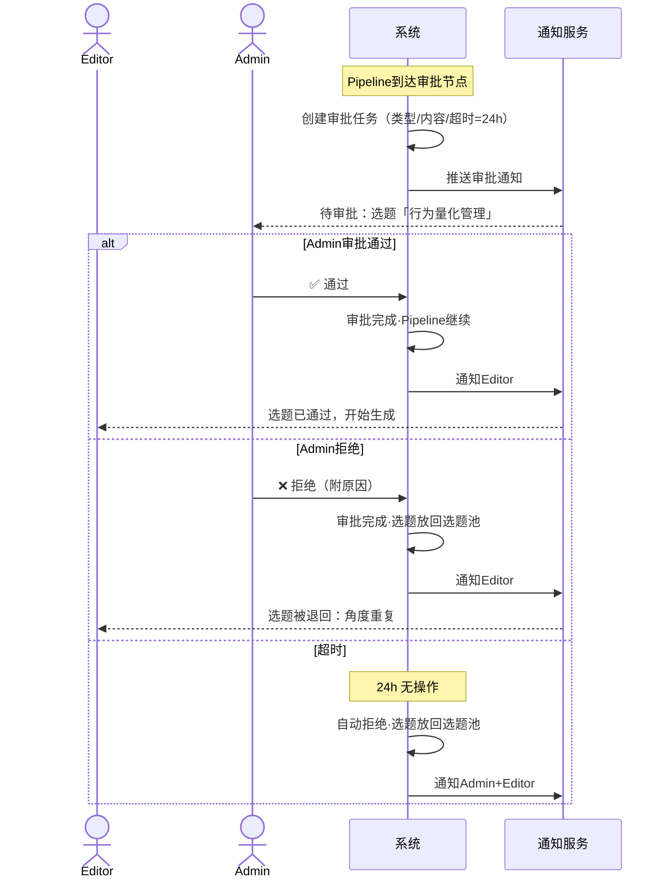
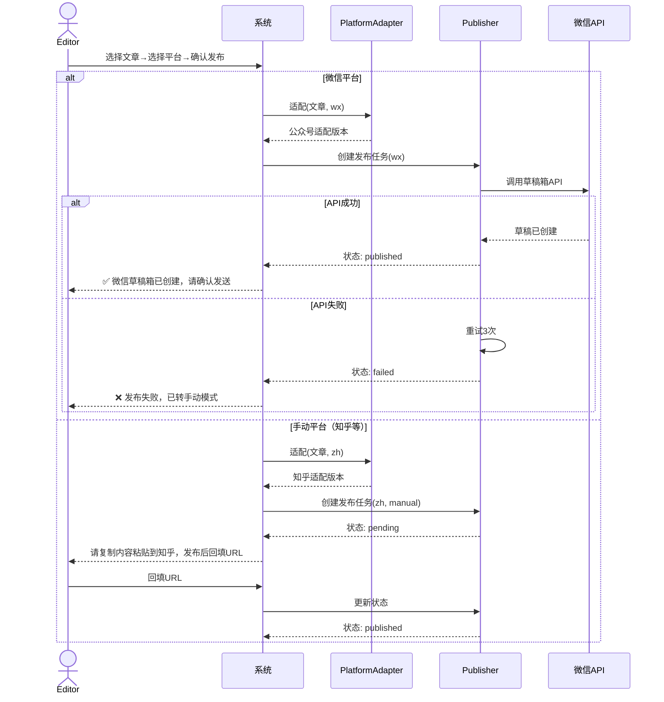
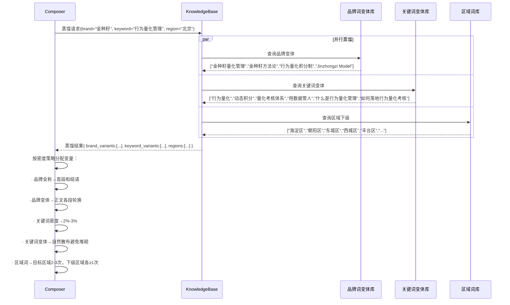
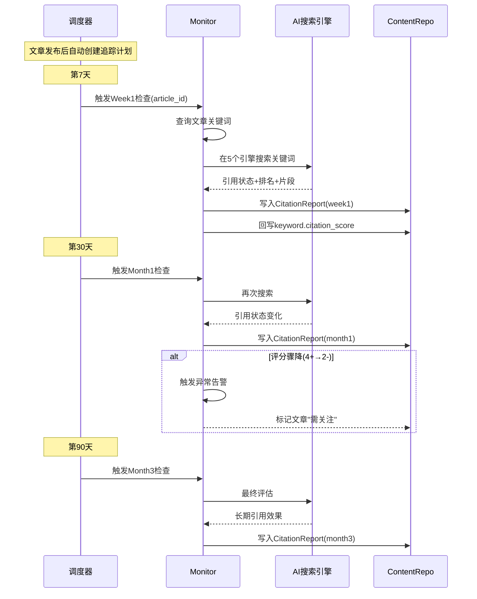
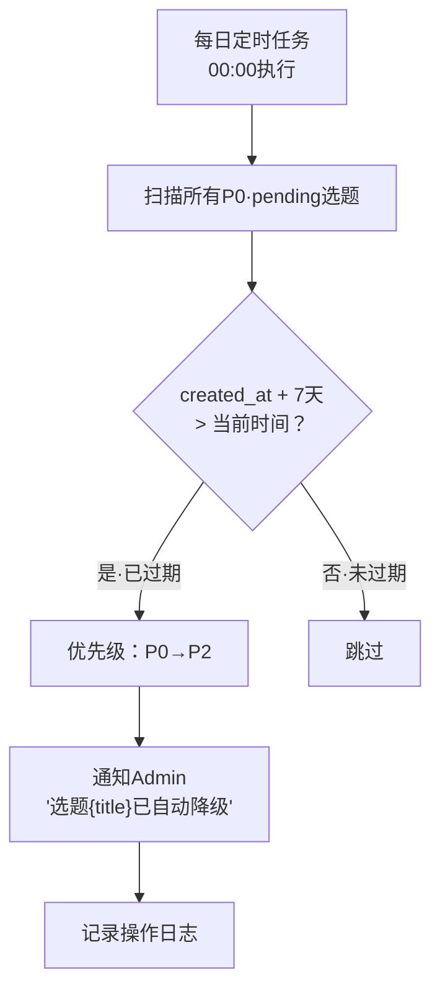
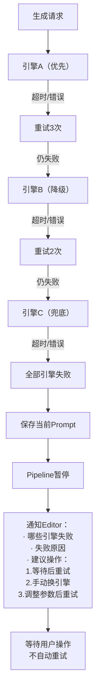
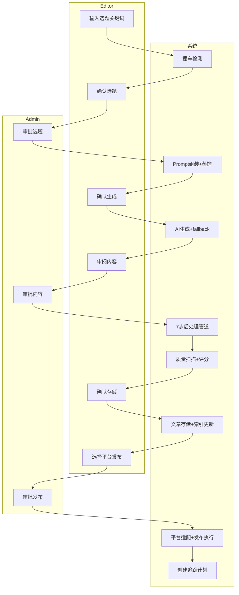

# 06 · 核心工作流规格

> 用户与系统之间的交互流程、系统内部流转和异常分支。

---

## 一、文章生产主流程

---

## 二、后处理管道内部流程

---

## 三、审批流程

---

## 四、发布流程

---

## 五、蒸馏引擎内部流程

---

## 六、效果追踪闭环流程

---

## 七、选题池自动降级流程

---

## 八、异常分支：AI 全部引擎失败

---

## 九、工作流泳道图：端到端

