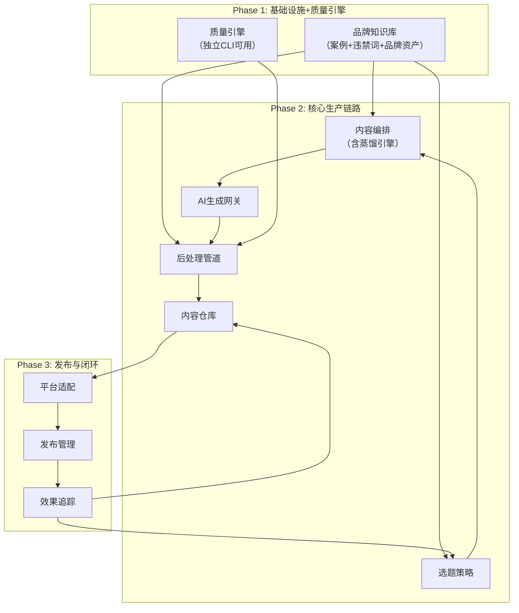
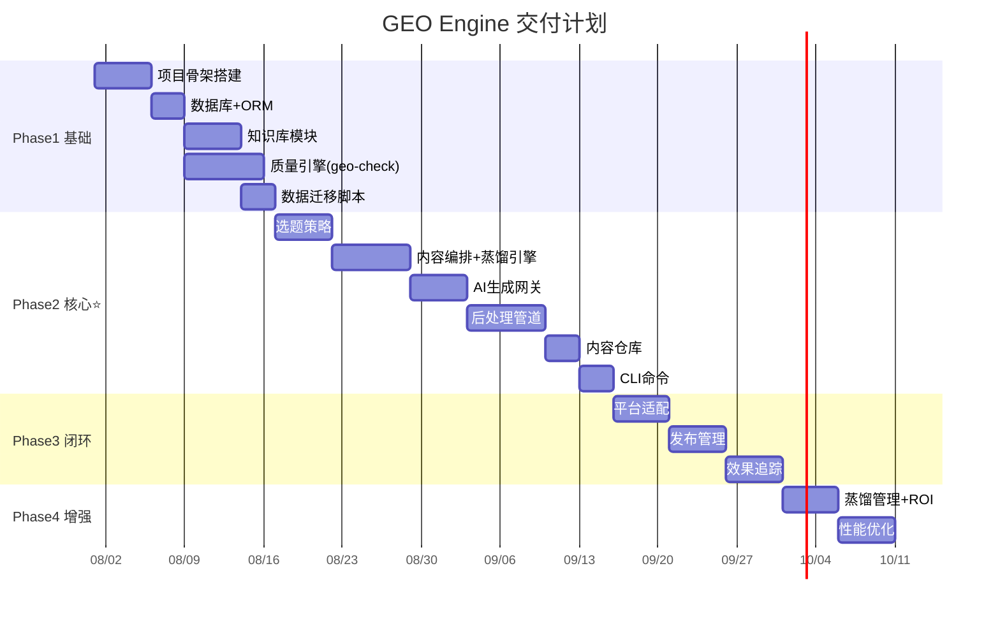

# 07 · 发布计划与里程碑

> 模块依赖关系、分阶段交付矩阵和验收里程碑。

---

## 一、模块依赖关系



---

## 二、分阶段交付矩阵

### Phase 1：基础设施 + 质量引擎（2-3 周）

**目标**：开发环境就绪 + 质量引擎 CLI 可用 + 旧系统数据入库

| 交付项 | 验收标准 |
|--------|---------|
| 项目骨架 | pnpm monorepo 可构建 |
| 数据库 | PostgreSQL + Drizzle ORM schema 就绪 |
| 知识库模块 | 案例/违禁词/品牌资产 CRUD |
| 质量引擎 | `geo-engine scan <path>` 输出与 geo-check.py 一致 |
| 数据迁移 | 141 篇文章/23 案例/33 关键词入库，脚本幂等 |
| CI | lint + typecheck + test 通过 |

**交付的故事**：US-09（案例管理）、US-11（违禁词库）

---

### Phase 2：核心生产链路（3-4 周）⭐ MVP

**目标**：完整的"选题→生成→后处理→存储"自动化闭环

| 交付项 | 验收标准 |
|--------|---------|
| 选题策略 | 撞车检测、选题池CRUD、关键词覆盖矩阵 |
| 内容编排 | Prompt 组装、变量注入、三层蒸馏引擎 |
| AI 生成网关 | 多引擎调用、fallback、Token 统计 |
| 后处理管道 | 7 步管道、可配置参数、质量扫描 |
| 内容仓库 | 文章 CRUD、目录规范、索引自动维护 |
| CLI 命令 | `produce`/`scan`/`status` 可用 |

**交付的故事**：US-01~08（Editor 全部）、US-12~15（Admin 审批+策略）

---

### Phase 3：发布与闭环（2-3 周）

**目标**：多平台发布 + AI 引用率自动追踪

| 交付项 | 验收标准 |
|--------|---------|
| 平台适配 | 5 平台格式转换、Schema 处理 |
| 发布管理 | 微信 API 草稿箱、手动发布追踪、定时调度 |
| 效果追踪 | 5 引擎引用率检查、里程碑追踪、数据回写、异常告警 |

**交付的故事**：US-16（引用率看板）

---

### Phase 4：增强与优化（1-2 周）

| 交付项 | 说明 |
|--------|------|
| 蒸馏词库管理界面 | US-10 |
| ROI 报告 | US-17 |
| 手动编辑增强 | 增量后处理、版本对比 |
| 性能优化 | 缓存策略、API 响应优化 |

---

## 三、里程碑



---

## 四、MVP 验收清单（Phase 1-2 完成时）

```
☐ 选题管理
   ☐ 撞车检测：返回撞车级别+建议
   ☐ 选题池：CRUD + P0-P3排序 + 自动降级
   ☐ 关键词覆盖：矩阵动态生成

☐ 内容生产
   ☐ Prompt组装：知识注入 + 蒸馏变量 + 规则全量注入
   ☐ AI生成：Kimi优先→DeepSeek fallback→全部失败有明确错误
   ☐ 后处理：7步管道全执行，每步可独立调试
   ☐ 质量报告：7维度检查 + 0-100评分 + 不达标建议

☐ 内容管理
   ☐ 文章存储：规范目录 + 索引自动更新 + 状态正确流转
   ☐ 知识库：案例/违禁词/品牌资产 CRUD

☐ 发布
   ☐ 微信草稿箱：API调用成功
   ☐ 手动平台：发布任务可追踪

☐ CLI
   ☐ geo-engine scan <path>：与 geo-check.py 输出一致
   ☐ geo-engine produce --keyword "xxx"：完成全流程
   ☐ geo-engine status <runId>：查看运行状态
```

---

## 五、模块与用户故事交付映射

| Phase | 模块 | 故事 |
|:---:|------|------|
| P1 | 知识库、质量引擎 | US-09, US-11 |
| P2 | 选题策略、内容编排、AI生成、后处理、内容仓库 | US-01~08, US-12~15 |
| P3 | 平台适配、发布管理、效果追踪 | US-16 |
| P4 | 蒸馏管理、ROI报告 | US-10, US-17 |
