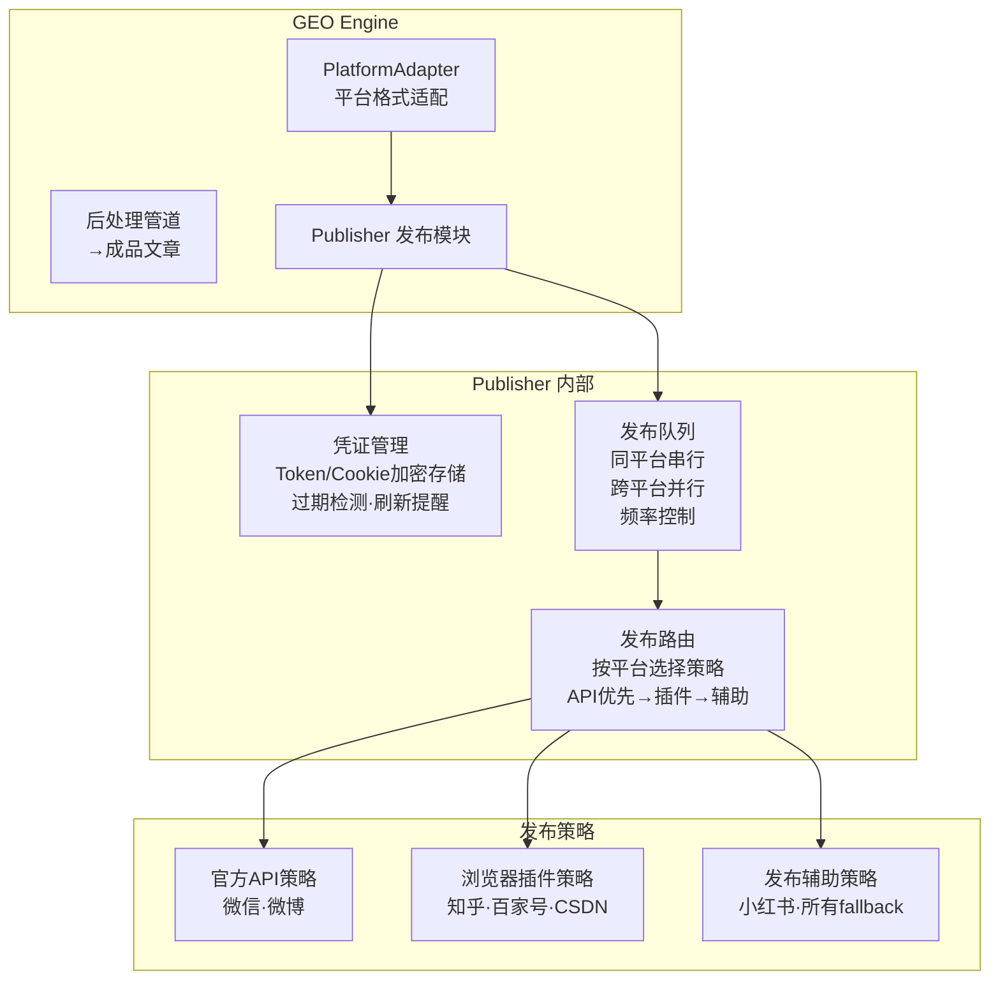
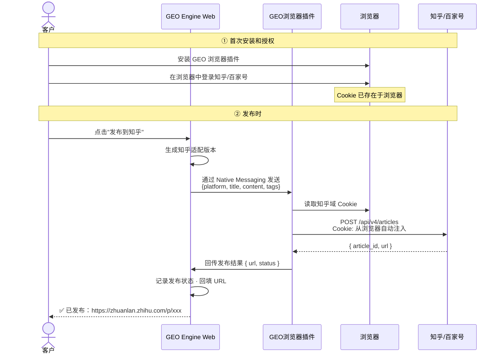
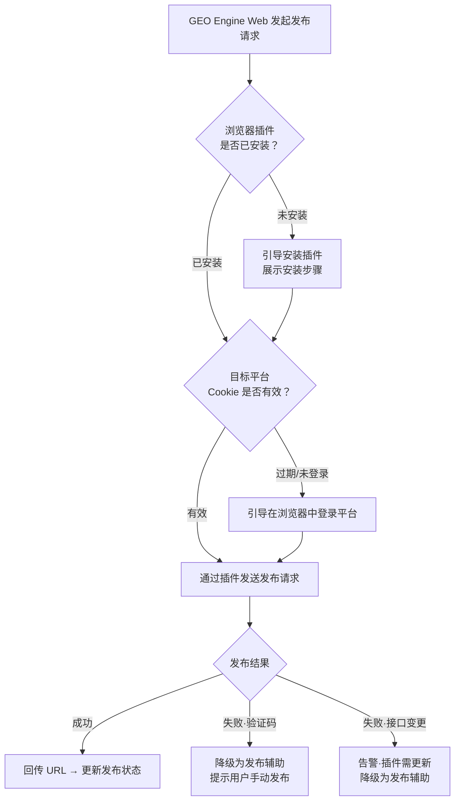
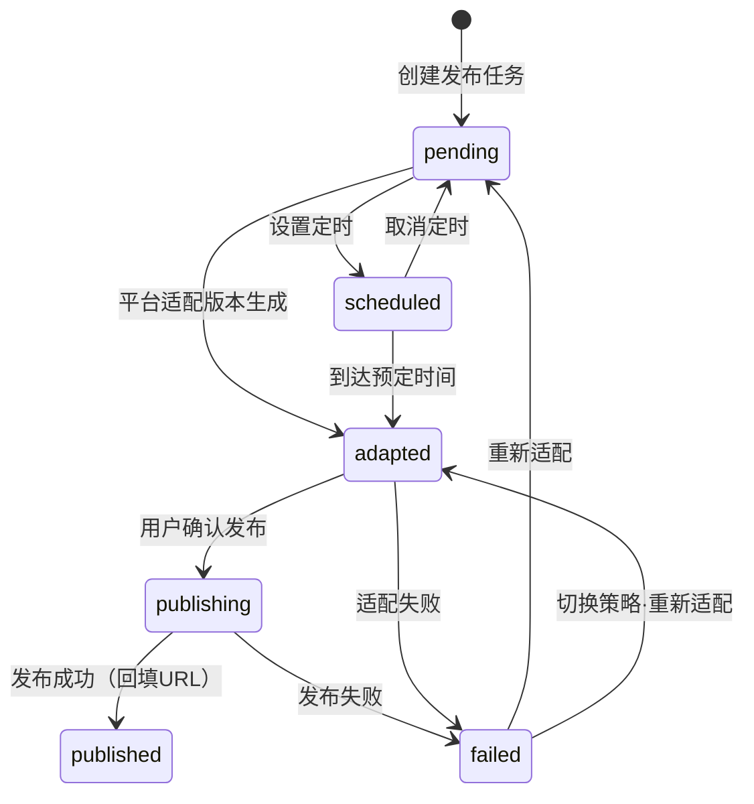

# 发布模块 · 可执行技术方案

> 多平台文章发布的架构设计、适配器规格、数据模型和实施计划。可直接指导开发。

---

## 一、模块架构

### 1.1 系统定位



### 1.2 平台策略矩阵

| 平台 | 策略 | 技术实现 | Phase |
|------|:---:|------|:---:|
| 微信公众号 | 官方 API | 草稿箱 API → 人工确认发送 | P2 |
| 微博 | 官方 API | 开放平台 API（OAuth 2.0） | P3 |
| 知乎 | 浏览器插件 | Manifest V3 插件 · 捕获 Cookie · 调知乎后端 API | P3 |
| 百家号 | 浏览器插件 | 同上 | P3 |
| 小红书 | 发布辅助 | 适配文本 + 一键复制 + 快捷入口 | P3 |
| 所有平台 | 发布辅助(fallback) | 当首选策略不可用时自动降级 | — |

---

## 二、策略一：官方 API（微信公众号 · 微博）

### 2.1 微信公众号草稿箱

```
授权流程：
  ① 客户在 GEO Engine 后台进入"平台授权"
  ② 扫码关注公众号 → 系统获取 openid
  ③ 通过微信公众号平台授权 → 获取 access_token
  ④ Token 加密存储（AES-256-GCM）· 记录过期时间
  ⑤ 过期前 1 天自动提醒重新授权

发布流程：
  GEO Engine → 微信 API：POST /cgi-bin/draft/add
    body: {
      articles: [{
        title: "行为量化管理：从KPI到动态行为积分",
        content: "<html>适配后的富文本...</html>",
        digest: "摘要（可选）",
        cover: "封面图 media_id"
      }]
    }
    → 返回 media_id
    → 客户在公众号后台确认发送（微信不允许 API 直接群发）

Token 管理：
  · access_token 有效期 2 小时
  · 每次调用前检查过期 → 过期自动用 refresh_token 刷新
  · refresh_token 过期 → 通知客户重新授权
```

### 2.2 微博开放平台

```
授权流程：
  ① 客户点击"授权微博"
  ② 跳转微博 OAuth 2.0 授权页
  ③ 客户确认 → 回调获取 access_token（有效期 30 天）
  ④ Token 加密存储

发布流程：
  POST https://api.weibo.com/2/statuses/share.json
    access_token=xxx
    status="行为量化管理：从KPI到动态行为积分 https://..."
  
  限制：单用户 150 次/天，需控制频率

内容适配：
  · 微博 140 字限制 → 提取文章摘要 + 关键词 + 短链接
  · 图片限制 4 张 → PlatformAdapter 自动选前 4 张并调整尺寸
```

### 2.3 数据模型：平台凭证

| 字段 | 类型 | 说明 |
|------|------|------|
| credential_id | string PK | 凭证 ID |
| tenant_id | string FK | 所属租户 |
| platform | enum | wx / wb |
| token_type | enum | access_token / refresh_token |
| token_value | text | 加密存储的 Token |
| expires_at | datetime | 过期时间 |
| status | enum | active / expired / revoked |
| created_at | datetime | — |
| updated_at | datetime | — |

---

## 三、策略二：浏览器插件（知乎 · 百家号）

### 3.1 插件架构



### 3.2 插件技术规格

```
平台：Chrome / Edge（Manifest V3）
权限：
  · cookies（读取目标平台域下的 Cookie）
  · nativeMessaging（与 GEO Engine Web 通信）
  · storage（本地缓存平台 API 端点配置）

支持的平台及其 API 端点（需维护）：

  知乎：
    POST https://zhuanlan.zhihu.com/api/articles
    Content-Type: application/json
    Cookie: 从浏览器读取 zhihu.com 域
    Body: { title, content, title_image, topics, publish }

  百家号：
    POST https://baijiahao.baidu.com/... （待逆向分析具体端点）
    Cookie: 从浏览器读取 baidu.com 域
    注意：百家号发布需要绑定手机号·部分账号可能弹验证码

安全措施：
  · 插件不上传 Cookie 到任何第三方服务器
  · 请求直接从用户浏览器发出
  · 插件开源可审计
```

### 3.3 插件发布流程



### 3.4 降级策略

插件方案的每次发布都有 fallback 到"发布辅助"的能力。当插件不可用或发布失败时，自动切换为：

- 展示适配文本
- 一键复制
- 打开平台页面
- 提示手动粘贴发布

---

## 四、策略三：发布辅助（兜底方案）

### 4.1 功能规格

这是所有平台的兜底策略，也是当前不支持自动化的平台的默认策略。

```
发布辅助流程：

  ① 用户选择目标平台
  ② 系统展示该平台的适配版本预览
     · 知乎版：Markdown·1500-2500字·Schema保留
     · 公众号版：富文本·1800-2500字·Schema移除
     · 百家号版：富文本·1500-2200字
     · 小红书版：短图文·800-1200字·话题标签
     · 微博版：摘要·500-800字·短链接
  ③ 用户确认内容
  ④ 一键复制全文（含格式）
  ⑤ 系统自动打开平台发布页（新标签页）
  ⑥ 用户粘贴 → 确认 → 发布
  ⑦ 用户回到 GEO Engine 回填发布 URL
  ⑧ 系统记录发布状态

差异提醒：
  系统在复制前自动检查：
    · 字数是否在平台范围内
    · Schema 是否正确处理
    · 图片数量和尺寸是否合规
  不合规项标红提示
```

### 4.2 数据模型：发布任务

| 字段 | 类型 | 说明 |
|------|------|------|
| task_id | string PK | 任务 ID |
| article_id | integer FK | 关联文章 |
| platform | enum | wx / zh / bjh / xhs / wb |
| strategy | enum | api / extension / assist |
| status | enum | pending / adapted / publishing / published / failed |
| adapted_content | text | 适配后的发布文本 |
| public_url | string | 发布后回填的 URL |
| scheduled_at | datetime | 计划发布时间 |
| published_at | datetime | 实际发布时间 |
| error_message | text | 失败原因 |
| retry_count | integer | 重试次数 |

### 4.3 发布任务状态机



---

## 五、发布队列设计

### 5.1 队列规则

```
同平台·同账号：
  · 串行执行
  · 最小间隔：微信 2s / 知乎 30s / 百家号 60s / 微博 5s / 发布辅助 不限
  · 单日上限：微信 不限(API) / 微博 150篇 / 知乎 50篇(插件·人工经验值)

跨平台：
  · 并行执行（不同平台独立队列）

频率控制：
  · 每个平台的相邻两次发布之间加随机延迟 ±30%
  · 避免固定间隔被平台识别为机器行为
```

### 5.2 队列数据结构

| 字段 | 说明 |
|------|------|
| queue_name | `publish:{platform}:{account_id}` |
| job_data | { task_id, article_id, platform, strategy } |
| priority | API > 插件 > 辅助 |
| delay | 定时发布的延迟时间 |
| retry_limit | API:3次 / 插件:2次 / 辅助:不限 |
| retry_delay | API:5s / 插件:30s |

---

## 六、发布结果追踪

### 6.1 发布记录

每次发布（无论成功失败）都记录：

| 字段 | 说明 |
|------|------|
| attempt_id | 尝试 ID |
| task_id | 关联发布任务 |
| strategy | 本次使用的策略（api/extension/assist） |
| result | success / failed / degraded（降级后成功） |
| public_url | 发布后的公开 URL |
| error_code | 失败时的错误码 |
| error_detail | 失败详情 |
| screenshot_url | 失败时的平台截图（插件方案） |
| duration_ms | 发布耗时 |
| created_at | 时间戳 |

### 6.2 平台状态看板

每个客户的后台展示各平台的连接状态：

| 平台 | 策略 | 连接状态 | Cookie/Token 有效期 | 操作 |
|------|:---:|:---:|:---:|------|
| 微信公众号 | API | ✅ 正常 | Token 1h50m后过期 | 重新授权 |
| 知乎 | 插件 | ⚠️ 未安装插件 | — | 安装插件 |
| 百家号 | 插件 | ✅ 正常 | Cookie 5天后过期 | 重新登录 |
| 微博 | API | ❌ 未授权 | — | 去授权 |
| 小红书 | 辅助 | 🟢 随时可用 | — | — |

---

## 七、实施计划

### Phase 2（MVP）：微信 API + 全平台发布辅助

| 交付项 | 验收标准 |
|--------|---------|
| 微信公众号授权 | OAuth 授权流程可用，Token 加密存储和自动刷新 |
| 微信公众号草稿箱 | API 创建草稿成功，客户在公众号后台可见 |
| PlatformAdapter | 5 平台格式适配版本正确生成 |
| 发布辅助 | 适配预览 + 一键复制 + 快捷入口 + 差异提醒 + URL 回填 |
| 发布任务管理 | 创建/查看/状态追踪 |
| 凭证管理 | Token/Cookie 过期检测和提醒 |

### Phase 3：微博 API + 浏览器插件

| 交付项 | 验收标准 |
|--------|---------|
| 微博 OAuth | 授权流程可用，发布成功 |
| 浏览器插件（知乎） | 安装 → Cookie读取 → 发布 → 成功回写 URL |
| 浏览器插件（百家号） | 同上 |
| 降级策略 | 插件不可用 → 自动降级为发布辅助 |
| 平台状态看板 | 各平台连接状态实时展示 |

### Phase 4+：小红书探索

观望平台是否开放官方 API，或 CDP 方案成熟度提升后再评估。

---

## 八、异常处理矩阵

| 异常 | 检测方式 | 处理 |
|------|---------|------|
| API Token 过期 | 调用前检查 expires_at | 自动刷新 · 刷新失败 → 通知重新授权 |
| 插件 Cookie 过期 | 发布前探测请求 | 引导客户在浏览器重新登录 |
| API 返回限流 | 429 状态码 | 等待 Retry-After 时间后重试 |
| 插件接口返回 403 | HTTP 403 | Cookie 失效 · 重新授权 |
| 验证码 | 响应包含验证码标识 | 降级为发布辅助 · 通知客户手动发布 |
| 平台接口变更 | 返回 404/400 | 告警 → 人工排查 → 更新端点配置 |
| 发布超时（>60s） | 超时检测 | 重试 1 次 → 仍超时 → 标记失败 |
| 适配版本生成失败 | Adapter 异常 | 标记 failed · 通知重试 |
